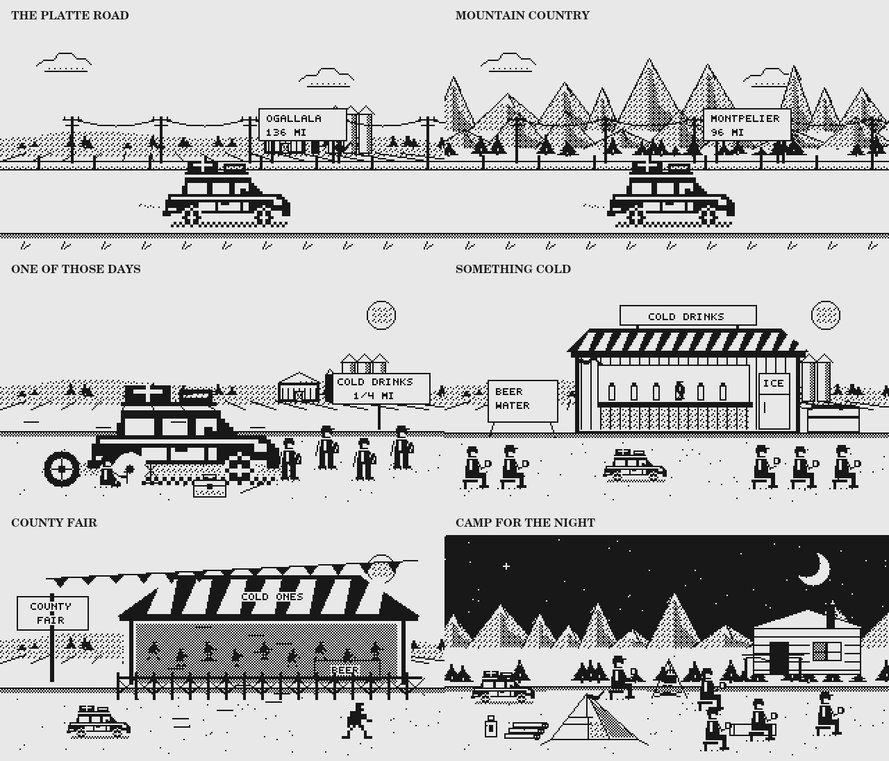
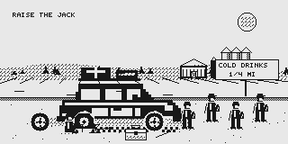
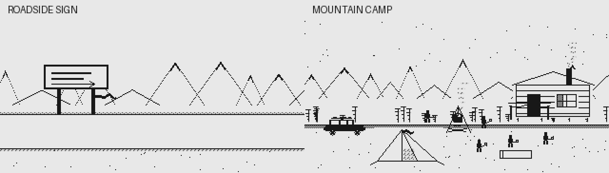

# Zombie Trails

A 1980s-style trail-survival game. Omaha, Nebraska to Boise, Idaho — about 1,320
miles of real road, up the Platte, over the Continental Divide, and down the Snake.
Up to five survivors, one station wagon, and three real forks in the road.

**[Play Zombie Trails](https://lancepounds.github.io/zombie-trails/)**

Monochrome, menu-driven, keyboard and touch. Plain JavaScript with no framework or
npm dependencies. The page requests fonts from Google Fonts and includes local
monospace fallbacks.

## The heart of the game

Keep it old school: black-and-white scenes, numbered menus, scarce supplies,
difficult choices, and dry humor. Guide your survivors west, manage the wagon,
choose roads, scavenge, and decide when to stop. More personality should deepen
that journey without turning it into a different kind of game.

## What's new in v1.7: a richer trail picture book

The game keeps its black-and-white, 320×160 pixel-art theme, with a more detailed
wagon and characters, deeper scenery, and illustrations that match the encounter.

- **A bigger travel wagon:** wood paneling, chrome trim, loaded roof rack,
  a driver in the window, turning wheels, and visible wear on a damaged body.
  Walking parties are easier to see too.
- **Regional scenery:** Nebraska fields, barns, grain silos, and windbreaks;
  shaded mountain ridges and fuller pines; desert mesas; town water towers;
  shaped clouds, sagging utility wires, and roadside grass.
- **Close-up repairs:** the tire scene has a detached wheel, jack, tools, and
  a kneeling traveler. Hood repairs show the open engine bay and tools. The
  summer flat has its own cold-drink sign and heat shimmer.
- **Distinct summer encounters:** a timber cold-drink stand with a striped
  awning, refrigerator, bottles, and seated travelers; an ice-store variant;
  a county-fair beer tent with pennants and zombies behind its fence; and a
  working irrigation sprinkler with the dead following its spray.
- **A fuller campsite:** seated travelers with cups, a shaded tent, lantern,
  stacked firewood, cabin or shelter, drifting smoke, and a crescent night sky.
  The title scene shares that night treatment; sickbed scenes have a cot,
  blanket, medicine box, and an attendant when another survivor is present.
- **Sharper bitmap shading:** exact ink-and-paper dithering instead of blurred
  pattern sampling. Static scenery is cached to keep drawing costs down.

Both light and dark themes, reduced motion, one-to-five-person parties, saved
journeys, and the existing untimed choices remain supported. The graphics do
not spend resources, change the journey's random seed, or alter event outcomes.



[See the dark-theme preview](docs/previews/retro-graphics-dark.png).
The [graphics validation notes](docs/graphics/v1.7.md) describe the checks and
how to regenerate these images.

## Latest content update: Midwest summer

**Ten new regional encounters and one linked cold-drink stop** bring the complete
event library to **201 events**, with 34 new choices. Two encounters each cover
road trouble, zombies, vehicle trouble, health, and camp life.

- **A flat tire in the heat:** the jack sinks, the tire iron burns, and everyone
  wants a cold beer. The repair adds 16 fatigue, costs morale and travel time,
  and makes you choose between a spare, a tool-kit patch, and limping onward.
  A failed patch or shredded tire leaves the wagon needing a normal repair.
- **Cold drinks afterward:** reach the farm stand and trade for cold beer and
  water to favor morale, or lemonade and more rest to favor fatigue recovery.
  Use your own canteens in the shade for free, or press on still exhausted.
  Purchases use existing trade goods; drinks are consumed at the stop.
- **More summer trouble:** buckled pavement, an ice freezer with rising prices,
  a zombie-filled fairground beer tent, dead people following a sprinkler,
  a failed cabin fan, a heat headache, spoiled lunch, mosquitoes, and a farm
  family's storm shelter. Choices spend time or supplies, affect the party or
  wagon, and sometimes attract more dead.

The journey still starts September 1. These encounters belong to the Nebraska
stretches in September; heat-specific scenes require actual Heat weather.
Camp scenes respect rain and warm-weather conditions and stay out of unrelated
landmark camps. Existing artwork, numbered menus, untimed choices, and saves
continue to work. The follow-up cannot appear as an independent random event.

See the [Midwest encounter and balance report](docs/balance/midwest-summer.md)
for the event list, consequences, and matched simulator results.

## What's new in v1.6

- **20 additional regional encounters** fill the six least-covered stretches,
  from the opening Missouri road to the Boise valley: 7 road, 6 zombie,
  2 vehicle, 3 health, and 2 camp events. Together with the new diner encounter,
  that release brought the library to 190 events, before the Midwest update above.
  Missouri gains 11 encounters; Lava Plain and Boise Valley gain 3 each;
  Laramie Range, Bear River, and Wasatch Front gain 1 each. All six regions
  now have 11–12 region-specific random events, alongside the shared encounters.
  See the [coverage and simulator comparison](docs/balance/regional-events.md).
- **Animated roadside stops:** the wagon rolls into a gas station, the Last Bite
  Diner, or a zombie-filled rest area and parks. The scene stays on screen until
  you choose; outcomes show the parked wagon without replaying the arrival.
- **More pixel-art detail:** pumps and hoses, diner windows and a swinging sign,
  picnic tables and a map board, a camp tent and kettle, repair tools, drifting
  smoke, passing fences, and clouds. Both monochrome themes are supported.
- **Living road signs:** destination boards pass along the shoulder and show
  the selected next stop and remaining leg mileage. Loose roadside and motel
  signs sway, and torn cloth strips move in the wind. At sign encounters the
  wagon rolls to a stop while you read; the arrival does not replay on outcomes.
- **Animated camp shelters:** wooded and mountain routes have a small cabin
  with chimney smoke; open country has a low roadside shelter. Shutters, porch
  canvas, tent flaps, and the hanging kettle move gently. Rest-area buildings
  have a loose door that moves in the breeze. These details are cosmetic and
  never spend supplies or consume the journey's random seed.
- **A diner encounter:** search the pantry, eat your own supplies in a booth,
  or keep going. Rewards still cost time, food, or noise.
- **Retro sound effects and ambience:** engine start and stop, gunfire, repairs,
  medicine, refueling, supply finds, rain, wind, thunder, radio static, campfire
  crackle, and distant zombie groans. All audio is synthesized locally; no sound
  files need to load. Cosmetic effects never consume the game's random seed.
- **Sound controls:** use **Sound: off/on** in the header. Sound starts off for
  new players. Settings include volume, a test chime, and an independent ambient
  sound switch. Preferences persist; audio needs a click, tap, or key press first.
  Muting cancels queued notes, and hidden tabs go silent and pause the game loop.
  Menu navigation, map selection, and supply quantity changes are silent.
  Ambient sound OFF also silences engine starts and roadside stops; repairs,
  gunfire, medical treatment, and other event cues remain available. Walking
  never plays the engine-start effect.
- **Reduced motion:** Settings can freeze scene animation, and your device's
  reduced-motion preference is respected automatically. Reduced flashing also
  suppresses the scavenging minigame's damage blink and full-screen flash.

Existing saved journeys and settings continue to load.

Spare-tire repairs now show an eight-second pixel animation: raise the jack,
remove the flat, fit the spare, tighten the lugs, and lower the wagon. It plays
after choosing a spare in the flat-tire encounters or repairing broken tires
from the wagon menu. The finished scene holds until Continue; you can continue
early. Reduced motion shows the completed repair immediately. Patching or
driving away does not play a spare replacement, and no looping sound is added.





The preview loops; in the game, arrivals play once and the scene waits for your
choice. Turning off scene animation, or enabling your device's reduced-motion
preference, keeps signs and shelters still.

## Added in v1.5

- Choose **one to five travelers**, including the driver. Names, roles, traits,
  and difficulty stay selected when setup is changed or redrawn.
- Each traveler has a selectable mechanical trait: **Roadwise** improves mileage,
  **Careful** saves fuel, **Quiet** reduces noise, **Hardy** reduces fatigue,
  **Light eater** needs less food, and **Steady** supports personal morale.
  The setup explains the numbers, and **How the party affects travel** shows
  each person's contribution. Group bonuses pause when someone is too unwell,
  exhausted, or isolated; each group bonus counts at most three helpers.
- Switch between **light and dark mode** using the header button or Settings.
  The preference is saved and applies to menus, pixel art, and the atlas.
- Ordinary travel ends on a day summary that waits for **Continue another day**.
  Event choices, outcomes, and arrivals also wait for input. Holding a shortcut
  cannot repeatedly skip scenes. Optional continuous travel pauses for encounters.
- Clear road shoulders replace scattered marks, and the atlas uses a wagon or
  walking-person icon for your position.

Older saved journeys keep their party and progress; travelers without a trait
receive Steady. Food and route estimates account for party size and traits.

## Added in v1.4.2: the retro look throughout

The atlas's paper-white and black-ink palette now carries through the title,
menus, party setup, shop, travel, encounters, journal, and ending. Pixel-art
scenes and the scavenging minigame use the same ink and paper colors, with the
original silhouettes and dither patterns. Inverse highlights, stippled frames,
and matching app icons complete the monochrome look. Scanlines stay inside the
artwork so menu text remains clear.

## Added in v1.4: the road atlas

- **v1.4.1 retro palette:** paper-white backgrounds, black ink, stippled map
  borders, and inverse selections give the atlas a classic monochrome computer
  look. Route patterns and readable labels distinguish each road and stop.
- A larger, sharp monochrome map with directly selectable stops, state boundaries,
  and a steady marker for your position between towns.
- Four zoom levels, **Your position** and **Whole route** controls, and a scrollable
  map on narrow screens so labels remain legible.
- Distinct marks for roads traveled, roads ahead, a selected route preview, and
  branches that are no longer reachable.
- Correct shortest-road distances to each stop, including alternate branches and
  the unfinished portion of the current leg.
- Road previews with next-stop mileage, total mileage to Boise, and estimates of
  travel days, food, and fuel. Previewing does not spend resources or advance time.
  At your current stop, **Take road** commits the next leg.
- Keyboard-accessible stops and a matching list with distances and travel status.

The map uses the existing game's coordinates and roads. Straight segments connect
stops; they do not trace every bend of the real highways. Estimates use current
conditions and can change as the journey unfolds.

### Map controls

| Control | Action |
|---|---|
| Click / tap a stop | Select it and read its route details |
| Tab, then Enter / Space | Select a focused map stop or activate a button |
| 1 / 2 | Select the next / previous stop in the east-to-west list |
| + / − | Zoom in / out |
| Home | Center on your position |
| 0 | Show the whole route |
| Esc | Return to the previous road or arrival screen |

## Added in v1.3

- **People in the wagon:** role-based personalities and short survivor dialogue,
  mixed with roadside atmosphere and radio fragments.
- **Choices that follow you:** a three-part encounter with Ruth and her family.
  Helping, taking supplies, trading, making amends, or walking away changes later
  meetings. These memories are saved with the journey.
- **Planning before travel:** estimates of full days of food and miles of fuel,
  plus warnings about urgent needs. Estimates reflect current conditions;
  weather, encounters, and changes in the party can alter them.
- **Time to read:** travel pauses after each day by default. Continuous travel is
  still available in Settings.
- **Comfortable controls:** larger menu buttons, browser zoom, text-size options,
  and Settings accessible from the road. New players default to menu-only
  scavenging; the optional timed minigame is still available.
- **A personal ending:** individual survivor remembrances and a record of the
  choices that followed the party.

Existing saved preferences are preserved. Role-based personalities provide the
dialogue, while v1.5's separately selected travel traits affect the journey.

## Playing and controls

1. Open the game, choose your party size, names, roles, traits, and difficulty,
   then buy supplies.
2. Choose a road and travel. Check the food and fuel estimates before committing.
3. Use the road menu to rest, scavenge, treat wounds, repair, or read the journal.

| Control | Action |
|---|---|
| Click or tap | Choose a menu option |
| Displayed number or letter | Activate that option where a single-key shortcut is shown |
| Up / Down arrows | Move between menu buttons |
| Enter / Space | Activate the focused button |
| Esc | Go back or stop travel where offered |
| S on the road menu | Open Settings |
| 0 on the road menu | Save and quit options |

Settings include light/dark mode, sound, reduced flashing and scanlines, text size, menu-only or
minigame scavenging, and day-by-day or continuous travel. No timed input is needed
for menu-only scavenging.

Saves, preferences, memorials, and scores are stored in the current browser.
Returning to the road screen saves the journey; use **Save and quit** before
leaving. Clearing browser storage removes local records. Saves do not sync
between devices.

## Run locally

Open `index.html` in a browser to play the built game. To edit and rebuild it,
install Node.js, clone this repository, then run:

```bash
node build.js
```

No `npm install` step is required. Reopen or refresh `index.html` after building.

---

## How this repo works

`index.html` is the whole playable game — the file GitHub Pages serves. It is
**generated**, not edited. The readable source is in the repository root, and `build.js`
concatenates it.

| File | Purpose |
|---|---|
| `00_core.js` through `90_ui.js` | 21 source modules, loaded in filename order |
| `style.css` | Styling |
| `icons.json` | Embedded icon data used by the build |
| `build.js` | Generates the playable HTML, manifest, and app icons |
| `test-story.js` | Story, save/load, and built-script checks |
| `test-content.js` | New regional events, resource gates, local eligibility, and choice outcomes |
| `test-midwest.js` | Summer weather and location gates, flat-tire/drink chain, costs, fatigue, and saved consequences |
| `test-map.js` | Distances, branch states, route previews, estimates, and label layout |
| `test-party.js` | Party size, traits, bonus caps, food use, estimates, old saves, and themes |
| `test-audio.js` | Gesture unlock, mute, scheduled notes, ambience, hidden tabs, and audio fallback |
| `test-render.js` | Optional native Canvas checks and preview generation; uses `@napi-rs/canvas` for development only |
| `sim.js` | Headless campaign simulator |
| `index.html` | Generated playable game; do not edit by hand |

To rebuild after changing the source:

```bash
node build.js
```

That rewrites `index.html`. Commit both the source change and the rebuilt file.

---

## What lives where

| File | Responsibility |
|---|---|
| `00_core.js` | Constants: regions, items, pace, rations, weather, difficulty, seeded RNG |
| `02_display.js` | Shared light and dark palettes |
| `05_route.js` | The route graph, real geography, map projection |
| `10_state.js` | Game state, save/load, save migration |
| `20_party.js` | Daily tick, health, fatigue, morale, infection, death |
| `25_effects.js` | `ZT.X.*` — the verbs event content calls |
| `30_vehicle.js` | Wear, breakdowns, fuel, repairs |
| `40_travel.js` | Graph traversal, seasonal weather, horde pressure, scoring |
| `50_events.js` | The event engine: filter, weight, pick, resolve |
| `60_ev_road.js` | Road and weather events |
| `61_ev_zombie.js` | The dead |
| `62_ev_vehicle_health.js` | The wagon, and the bodies in it |
| `63_ev_people_camp.js` | Other people, camp nights, rare events |
| `64_landmarks.js` | Arrivals at each real place |
| `65_story.js` | Survivor personalities, atmosphere, supply forecasts, delayed story encounters, and ending remembrances |
| `70_scavenge.js` | Scavenging, menu and minigame |
| `80_render.js` | The monochrome renderer, bitmap font, the map, ~80 scenes |
| `82_atlas.js` | Interactive atlas, shortest paths to stops, leg estimates, and SVG layout |
| `85_save_audio.js` | Save slots, settings, memorials, high scores |
| `86_audio.js` | Synthesized effects, ambient sound, volume, gesture unlock, mute lifecycle |
| `90_ui.js` | Screens, input, modals |

---

## Adding an event

This is the main way to grow the game, and it needs no engine changes. Add an
object inside the relevant `ZT.Events.add([...])` list in `60_ev_road.js`
through `63_ev_people_camp.js`, then rebuild. Landmark events live in
`64_landmarks.js`; the delayed Ruth encounters live in `65_story.js`.

```js
{
  id: 'road_thing_01',              // must be unique
  cat: 'road',                      // road|zombie|vehicle|health|weather|people|camp|rare
  regions: ['platte', 'sandhills'], // or '*' for anywhere
  when: 'travel',                   // travel | camp | any
  weight: 6,                        // higher = more often
  cool: 20,                         // days before it can repeat
  cond: (s) => s.miles > 100,       // optional gate
  art: 'lm_town',                   // any key in ZT.R.scenes
  text: 'A thing is in the road.',
  choices: [
    { text: 'Deal with it', hint: 'costs a day',
      show: (s) => s.inv.parts > 0,             // optional: hide unless true
      do(s, c) {
        ZT.X.take(s, c, 'parts', 1);
        ZT.X.delay(s, c, 1);
        return 'What happened, in a sentence or two.';
      } },
    { text: 'Drive past', do() { return 'You drive past.'; } },
  ],
}
```

Return `{ text, then: 'other_event_id' }` from a `do` to chain a second beat —
that is how the landmark set pieces work. For consequences days later, follow
`ZT.Story.due` and `ZT.Story.remember` in `65_story.js`: the story checks both
elapsed days and distance, keeps the encounter out of the ordinary random pool,
and records the result in saveable flags. Keep display-only helpers free of
state changes and random-number consumption.

**Region ids:** `missouri, platte, sandhills, panhandle, laramie, powder, divide,
bear, wasatch, lava, snake, owyhee`

**Common verbs** (all in `25_effects.js`): `take` `give` `hurt` `heal` `injure`
`sicken` `bite` `expose` `fatigueAll` `morale` `noise` `horde` `wear` `repair`
`breakdown` `delay` `loot` `shots` `someone`

**Tone:** concise, dry, occasionally darkly funny. A dropped tire iron can be as
memorable as a horde. Humour works best delivered flat.

---

## Validation and balance

Build first so the tests inspect the current playable file:

```bash
node build.js
npm run test:quick
```

The quick command runs the party, map, story, regional-content, Midwest-content, and audio checks plus
480 simulated campaigns: 10 runs for each combination of four difficulties,
three choice policies, and four opening loadouts. For 1,920 simulated campaigns
and the same focused checks:

```bash
npm test
```

You can also run `node test-content.js`, `node test-midwest.js`, `node test-map.js`, `node test-story.js`, or `node sim.js 40` separately. Map
checks cover all 289 stop pairs against enumerated routes, partial-leg mileage,
unavailable branches, walking, preview state preservation, and non-overlapping
labels at every zoom. The story
checks cover the six tested encounter paths, resource-gated choices, delayed
consequences, save/load persistence, display helpers that leave state unchanged,
and built-script syntax. The simulator reports wins, deaths, supplies, routes,
and event coverage; it exits unsuccessfully if campaign crashes occur.

### Latest content balance check

The Midwest summer update was compared against `main` at `c8eae33` using
`node sim.js 40`: **1,920 journeys before and 1,920 after**, with the same seeds,
difficulties, policies, and loadouts. Both completed with **zero crashes**;
all ten new random encounters appeared. The full test suite also passed,
including **9,024 Midwest choice outcomes**, both repair-gamble branches,
unaffordable-choice hiding, free alternatives, saved consequences, and fatigue
that reduces later travel speed.

| Difficulty | Before win rate | After win rate | Change |
|---|---:|---:|---:|
| Story | 99.8% | 99.8% | 0.0 percentage points |
| Normal | 60.2% | 57.3% | −2.9 percentage points |
| Hard | 42.3% | 44.6% | +2.3 percentage points |
| Nightmare | 5.2% | 4.6% | −0.6 percentage points |

This sample moved in both directions, with 480 journeys per difficulty.
It does not establish a general difficulty shift; new encounters also change
later random draws. No global balance settings or simulator policies changed.
The [full report](docs/balance/midwest-summer.md) includes raw output and limits.

### September 17 regional content balance check

The 20-event expansion was compared against `main` at `fc38708` using
`node sim.js 200`: **9,600 journeys before and 9,600 after**, with identical
starting seeds, policies, loadouts, and difficulty settings. Both runs completed
with **zero crashes**, and all 20 new events appeared in the expanded run.
This comparison isolates the 20-event expansion before the separate diner
encounter from the graphics update was combined with it.

| Difficulty | Before win rate | After win rate | Change |
|---|---:|---:|---:|
| Story | 99.3% | 99.5% | +0.2 percentage points |
| Normal | 62.1% | 61.4% | −0.7 percentage points |
| Hard | 42.9% | 42.0% | −0.9 percentage points |
| Nightmare | 6.0% | 5.0% | −1.0 percentage points |

The sample moved slightly toward harder play outside Story mode. Nightmare's
one-point drop is proportionally larger because wins were already uncommon.
Infection remained the leading reported cause of death. No compensating balance
changes were made. These are sample results from the simulator's five-person AI
parties; new events change later random-number consumption even with matching
starting seeds.

The regional-content checks also passed **27,680 choice outcomes**, including
solo parties, walking, scarce supplies, resource costs, and save/load. The
[full report](docs/balance/regional-events.md) records the method, regional and
category counts, and raw before/after output.

After combining the graphics, animation, audio, diner, and regional-content
updates, the release passed all focused checks and **1,920 simulated journeys
with zero crashes**. All 20 new regional events appeared. The combined build
contains 190 events; its [simulator output](docs/balance/v1.6-combined-release.txt)
is kept separately from the larger matched balance comparison above.

### Earlier validation

The v1.7 graphics release passed the focused gameplay checks and 480 simulated
journeys with zero crashes. Its separate native Canvas checks verify scene
rendering, both themes, motion-off frames, animation, parked arrivals, survivor
counts, on-foot play, exact palette output, and game-state preservation. See
the [v1.7 graphics notes](docs/graphics/v1.7.md) for the render count and limits.

During v1.3 development, 480 campaigns completed with zero game crashes. Their
report exposed an outdated landmark constant in the simulator; after fixing it,
48 further campaigns and the focused checks passed. The 480-run sample won
100% on Story, 52.5% on Normal, 35% on Hard, and 6.7% on Nightmare. These are
sample results, not guarantees or a substitute for player feedback.

The v1.4 atlas and v1.4.1 palette were checked with native SVG renders of the
overview, a zoomed view, and a journey in progress. For v1.4.2, all 101 scene
renderers ran without scene errors in native Canvas with scanlines on and off;
representative scenes, the scavenging view, and the app icon were visually checked.
For v1.6, 1,920 simulated journeys completed without crashes. Native Canvas
checks covered 1,648 scene/theme/weather/motion combinations, still frames in
reduced-motion mode, settled arrivals, and graphics that leave the game state
and random seed unchanged. Chromium checks covered a new journey, event
choices, untimed scenes, saved settings, resumed games, both themes, and a
390-pixel mobile viewport. Native OfflineAudioContext rendering verified that
the effects produce audio without clipping and that muting cancels queued notes.
The dependency-free audio tests cover hidden tabs and unsupported audio too.
The later sign-and-camp update passed 1,718 native Canvas renders across both
themes, seven weather conditions, one/five travelers, driving/walking, every
route destination, and the shelter variants. Pixel comparisons confirmed that
the new signboards, ribbons, shutter, porch canvas, tent flap, chimney smoke,
and rest-area door move, and that motion-off freezes the scenes completely.
Rendering preserves the game state and random seed; settled sign arrivals stay
parked. Party, map, story, built-script, and audio checks also passed.
Safari and physical mobile-device audio have not been tested. Automated
campaigns and native renders do not verify the full page layout, touch interaction,
or how the story feels.

When changing balance, watch whether scavenging can cover the food consumed
during a search and whether one cause of death overwhelms the others.

---

## Publishing a change

1. Edit the numbered JavaScript modules or `style.css`
2. `node build.js`
3. Run the relevant checks above
4. Commit the source **and** the rebuilt `index.html`; include other generated assets if they changed
5. Merge the update into `main`
6. Check **Actions → pages build and deployment** for a successful publication

README-only changes do not require rebuilding the game. Publication time varies;
refresh the game after deployment if the previous version is still displayed.

## Installing on an iPad

Open the [game](https://lancepounds.github.io/zombie-trails/) in Safari, then choose
**Share → Add to Home Screen**. Saves remain local to that browser or installed
web app; adding an icon is not a cloud backup. This project has no service
worker, so it does not guarantee offline loading.
